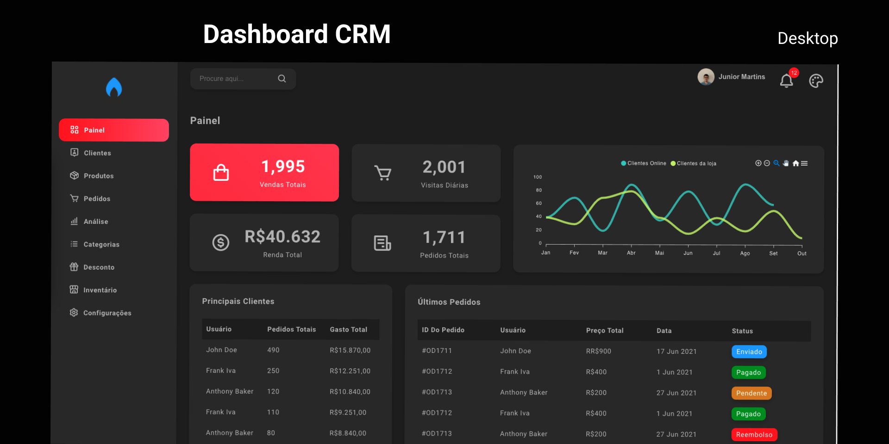

<p align="center">
  
</p>

<p align="center">
  
</p>

<h1 align="center">
    
</h1>

<br>

## 🧪 Tecnologias

Esse projeto foi desenvolvido com as seguintes tecnologias:

- [React](https://reactjs.org)
- [Redux](https://redux.js.org/)

## 🚀 Como executar

Clone o projeto e acesse a pasta do mesmo.

```bash
$ git clone https://github.com/jrxr/DashboardCrm.git
$ cd DashboardCrm
```

Para iniciá-lo, siga os passos abaixo:
```bash
# Instalar as dependências
$ yarn
# Iniciar o projeto
$ yarn start
```
O app estará disponível no seu browser pelo endereço http://localhost:3000.


## 💻 Projeto

O Dashboard Front-end, foi feito para acompanhar as vendar,em tempo real, informações sobre o desempenho da área comercial, como o número de negócios fechados e o percentual alcançado das metas. Nesse painel, os dados ficam organizados de maneira visual, podendo ser consultados facilmente pela equipe.

## 📝 License

Esse projeto está sob a licença MIT. Veja o arquivo [LICENSE](LICENSE.md) para mais detalhes.

---

Feito com 💜 by Agacy Júnior 💻